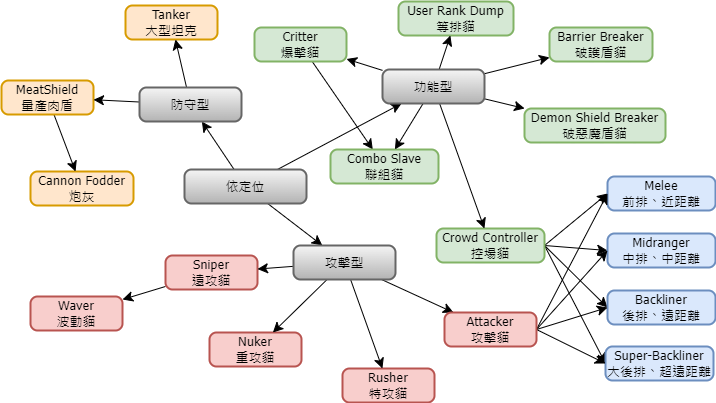

## 射程分析

### Melee | 前排輸出、近距離輸出

條件：射程小於 250

範例：大狂鳥、康康舞貓、姆特三階、喵魔

### Midranger | 中排輸出、中距離輸出

條件：射程介於 250~399

範例：飛腳、美模、腿貓、二人組、卡莉法

### Backliner | 後排輸出、遠距離輸出

條件：射程介於 400~499

範例：龍貓、姆特二階、多數超激

### Super-Backliner | 大後排輸出、超遠距離輸出

條件：射程大於等於 500

範例：手甩、風神（四階）、佛挪（黑、白）、美女神

## 定位分析

### Cannon Fodder | 炮灰

特性：體力少、生產快、便宜、射程近的角色，通常受到攻擊後就死亡。

範例：貓咪、狂歡貓

### MeatShield | 量產肉盾

特性：體力中、生產快、射程近的角色、至少要擋一下傷害不死。

範例：牆貓、大狂牆、貓飯糰、拉麵

### Critter | 爆擊貓

特性：擁有會心一擊能力的貓。

範例：萌貓、侏羅、聖騎士

### Waver | 波動貓

特性：擁有波動能力的貓。

範例：大狂腿、水母、吳仲力、嬰兒車

### Barrier Breaker | 破護盾貓

特性：擁有破盾能力的貓。

範例：擊劍貓、小小腿貓。

### Demon Shield Breaker | 破惡魔盾貓

特性：擁有破惡魔盾能力的貓。

範例：海盜桶貓、貓咪研究家、怒髮、莉莉

### Tanker | 大型坦克

特性：體力高的大型單位。

範例：龍宮獸、八戒、機器貓、人魚、陸王砲、帝獸、石精靈。

### Nuker | 重攻貓

特性：攻擊力高的單位。

範例：風神、小丑、拉斯沃斯、第6貓使徒

### Rusher | 特攻貓

特性：移動速度快的單位。

範例：真田幸村、姆特貓（三階）、異弟、快泳、特急、布蘭卡

### Combo Slave | 聯組貓

特性：依靠強力聯組上場的單位。

範例：幽魂吶吶、單輪車貓、小小薰、小小真嗣

### Crowd Controller | 控場貓

特性：給予敵人妨害效果的單位。

範例：法師貓、漂流貓、癒術士、時空神

### Sniper | 遠攻貓

特性：通常具有波動、烈波能力，或屬於遠方/全方位攻擊並且有溢出的範圍

範例：貓咪球、水母貓、撐杆跳貓、古獸納拉、小紅帽

### User Rank Dump | 等排貓

特性：增加等級排行與地底迷宮用。

範例：不明貓一族（一階）、遠古的蛋（一二階）、殺意貓（一二階）、殺意坦克貓、謎之神、賤萌熊、百太郎、ネコチュートリアル
